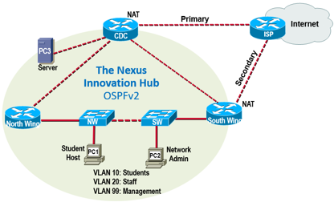
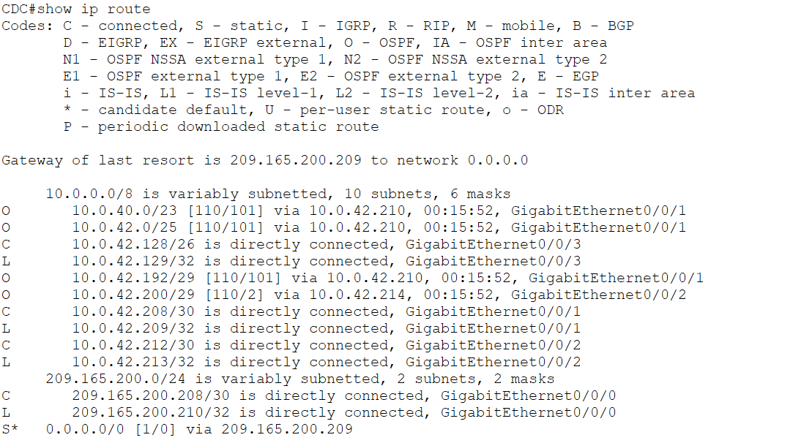
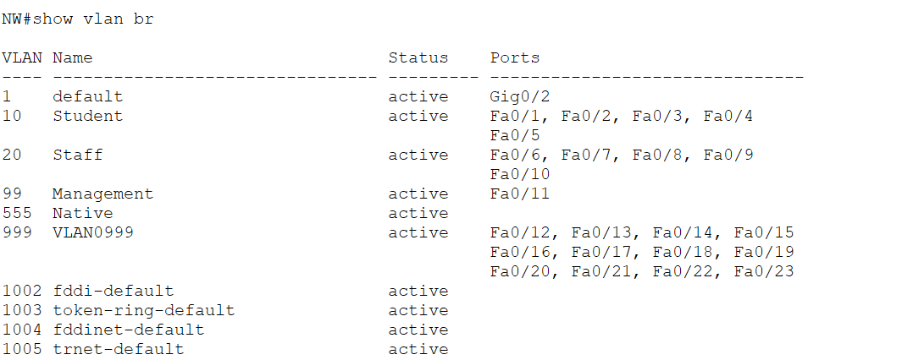
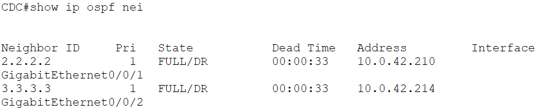
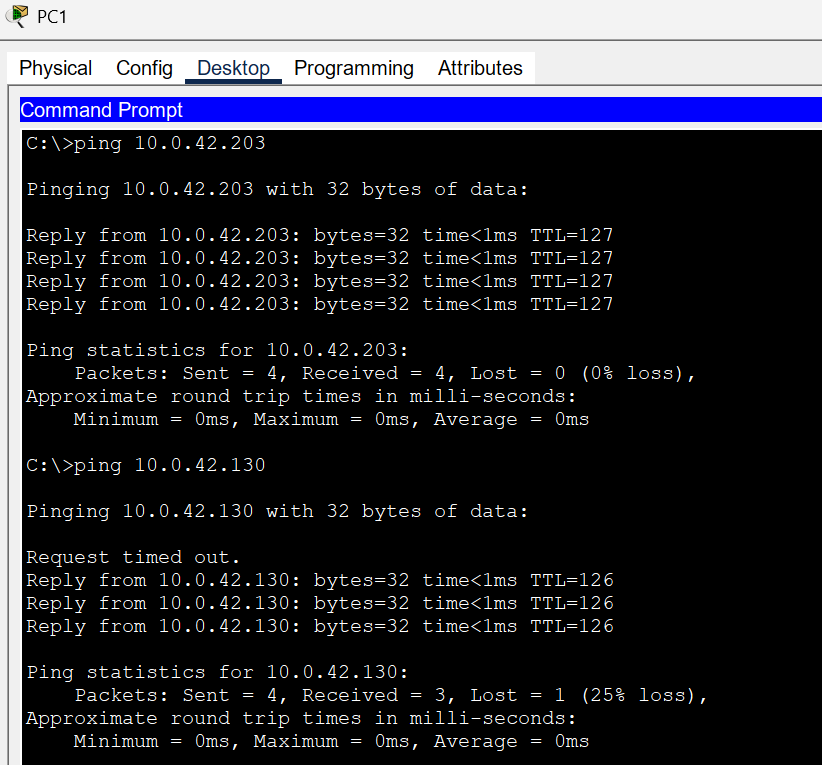

# Enterprise Network Simulation

## Overview

This project demonstrates the design and implementation of a simulated enterprise network using Cisco Packet Tracer.

The network includes VLAN segmentation, dynamic routing, DHCP services and access control to emulate a small enterprise environment.

---

## Technologies

- Cisco Packet Tracer
- Cisco IOS
- VLAN
- Inter-VLAN Routing
- OSPF
- DHCP
- ACL

---

## Network Topology

---

## Key Features

- Multi-VLAN enterprise network
- Dynamic routing using OSPF
- DHCP address allocation
- Access Control Lists (ACL)
- Router-on-a-Stick configuration
- Network troubleshooting and verification

---

## Verification

Example verification commands:

show ip route

show vlan brief

show ip ospf neighbor

ping

